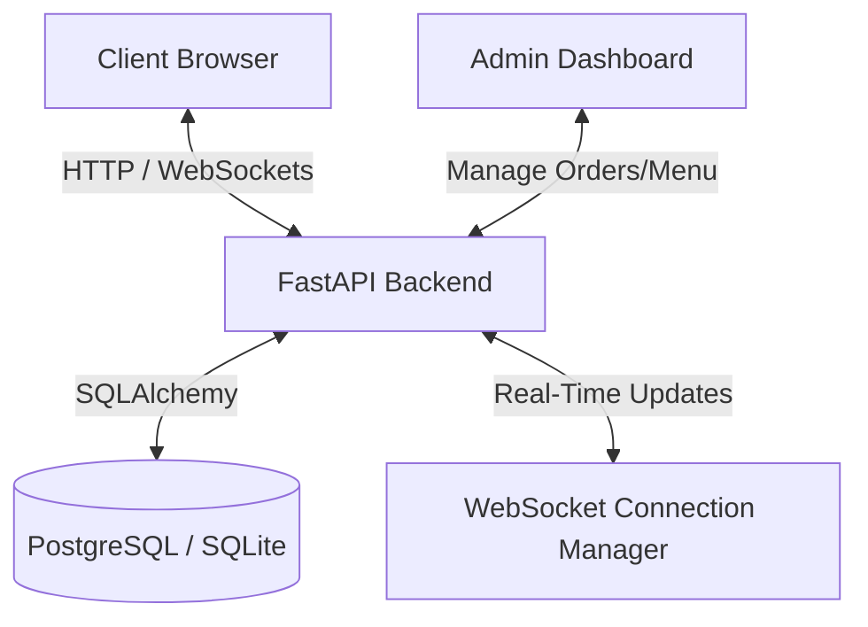

# Implementation Plan - ZEST College Canteen Ordering Platform

ZEST is a premium, full-stack college canteen ordering web application featuring a modern, startup-grade design inspired by ZEST menu cards. It features dark/light modes, seamless animations (Framer Motion), instant search/filters, a real-time order tracking system (via WebSockets), a full cart sidebar/drawer, and a dedicated administrative panel for order tracking, inventory management, and analytics.

---

## User Review Required

> [!IMPORTANT]
> - **Database Configuration**: We will configure SQLAlchemy to connect to a PostgreSQL database by default (supporting Docker environments). For local standalone development without Docker/PostgreSQL running, it will automatically fallback to a local SQLite database (`zest.db`) to ensure the application starts and runs out-of-the-box.
> - **Admin Credentials**: We will include a database seed script (`backend/seed.py`) to automatically prepopulate categories, featured menu items, and a default admin user (`admin@zest.com` / `ZestAdmin2026!`).
> - **Image Assets**: Since the app requires high-quality food imagery, category icons, and 3D food illustration placeholders, we will implement beautiful SVG icons and modern curated Unsplash imagery for food categories (Breakfast, Biryani, Rice, etc.).

---

## Open Questions

> [!NOTE]
> 1. **College Email Validation**: Should the signup email be restricted to specific college domains (e.g., `@college.edu`), or should any valid email address be accepted? (Plan: We will add a flexible validation regex that can check domain names, but accept any valid format by default.)
> 2. **WebSocket Fallback**: In case of transient network drops on mobile devices, do you want the frontend to automatically reconnect and poll for order status if the WebSocket connection fails? (Plan: We will implement an automatic reconnection policy in the React WebSocket hook.)

---

## Proposed Changes

We will organize the project into two main directories: `backend` for the FastAPI server and database schemas, and `frontend` for the Next.js 15 application.

### Backend (FastAPI + SQLAlchemy)

We will write a standard FastAPI app with clean separations.

#### [NEW] [backend/requirements.txt](file:///c:/Users/vishn/OneDrive/Desktop/Zest/backend/requirements.txt)
Python dependency list including: `fastapi`, `uvicorn`, `sqlalchemy`, `psycopg2-binary`, `python-jose[cryptography]`, `passlib[bcrypt]`, `pydantic[email]`, `websockets`, and `python-multipart`.

#### [NEW] [backend/app/core/config.py](file:///c:/Users/vishn/OneDrive/Desktop/Zest/backend/app/core/config.py)
Config class using `pydantic-settings` to handle environment variables: JWT Secret Key, Database URL, Token Expiry, and rate limiting parameters.

#### [NEW] [backend/app/core/security.py](file:///c:/Users/vishn/OneDrive/Desktop/Zest/backend/app/core/security.py)
Utility functions for password hashing using bcrypt (`passlib`) and JWT token creation, decoding, and validation.

#### [NEW] [backend/app/core/database.py](file:///c:/Users/vishn/OneDrive/Desktop/Zest/backend/app/core/database.py)
SQLAlchemy engine configuration, session maker, base model class declaration, and `get_db` dependency helper.

#### [NEW] [backend/app/models.py](file:///c:/Users/vishn/OneDrive/Desktop/Zest/backend/app/models.py)
Database declarations for tables:
- **User**: id, full_name, email, phone, password_hash, role (user/admin), created_at
- **Category**: id, name, image
- **MenuItem**: id, category_id, name, description, image, price, is_veg, is_available, availability_status (In Stock, Out of Stock, Limited Stock)
- **Order**: id, user_id, order_status (Pending, Accepted, Preparing, Ready, Completed, Rejected), total_amount, created_at
- **OrderItem**: id, order_id, menu_item_id, quantity, item_price

#### [NEW] [backend/app/schemas.py](file:///c:/Users/vishn/OneDrive/Desktop/Zest/backend/app/schemas.py)
Pydantic schemas for request validation and response serialisation:
- User signup, login, profile responses, token schemas.
- MenuItem creation, update, and search schemas.
- Order creation, item mappings, and status update schemas.

#### [NEW] [backend/app/routers/auth.py](file:///c:/Users/vishn/OneDrive/Desktop/Zest/backend/app/routers/auth.py)
Endpoints for registration, login, token refresh, and user profile retrieval.

#### [NEW] [backend/app/routers/menu.py](file:///c:/Users/vishn/OneDrive/Desktop/Zest/backend/app/routers/menu.py)
Endpoints to fetch categories, menu items, search, and perform advanced filter options (veg/non-veg, availability, price ranges).

#### [NEW] [backend/app/routers/orders.py](file:///c:/Users/vishn/OneDrive/Desktop/Zest/backend/app/routers/orders.py)
Endpoints to create order, get order history, view specific order status, and cancel orders.

#### [NEW] [backend/app/routers/admin.py](file:///c:/Users/vishn/OneDrive/Desktop/Zest/backend/app/routers/admin.py)
Protected admin-only endpoints for revenue analytics, menu items CRUD, inventory stock toggles, order acceptance, and status updating.

#### [NEW] [backend/app/main.py](file:///c:/Users/vishn/OneDrive/Desktop/Zest/backend/app/main.py)
Main FastAPI app setup, including CORS middleware, mounting routers, and the WebSocket Connection Manager for real-time push notifications of order changes to users and admins.

#### [NEW] [backend/seed.py](file:///c:/Users/vishn/OneDrive/Desktop/Zest/backend/seed.py)
Data seeding script that initializes categories (Breakfast, Biryani, Burgers, Juices, Mocktails, etc.), adds standard starting menu items with images, and creates the admin account.

---

### Frontend (Next.js 15 + Tailwind CSS + Framer Motion)

We will initialize Next.js 15 inside the `frontend` folder using typescript and Tailwind.

#### [NEW] [frontend/src/app/globals.css](file:///c:/Users/vishn/OneDrive/Desktop/Zest/frontend/src/app/globals.css)
Global styling definition, custom dark/light theme colors matching ZEST menu card colors (dark slate textured background, orange `#F26E21` primary accents, bright yellow stars, white headers, sleek border styling, and glassmorphism styling).

#### [NEW] [frontend/src/store/useCartStore.ts](file:///c:/Users/vishn/OneDrive/Desktop/Zest/frontend/src/store/useCartStore.ts)
Zustand store for managing the shopping cart state: adding, updating quantity, removing, and computing subtotals/totals. Persists state locally using local storage middleware.

#### [NEW] [frontend/src/store/useAuthStore.ts](file:///c:/Users/vishn/OneDrive/Desktop/Zest/frontend/src/store/useAuthStore.ts)
Zustand store for tracking authenticated user/admin details, tokens, active roles, and logging out.

#### [NEW] [frontend/src/hooks/useWebSocket.ts](file:///c:/Users/vishn/OneDrive/Desktop/Zest/frontend/src/hooks/useWebSocket.ts)
Custom React hook managing WebSocket connections for live notifications of order status changes.

#### [NEW] [frontend/src/components/Navbar.tsx](file:///c:/Users/vishn/OneDrive/Desktop/Zest/frontend/src/components/Navbar.tsx)
Sticky navigation component with high-end glassmorphic blur backdrop, visual brand alignment (ZEST logo, cloche illustration), links, and user authentication state actions.

#### [NEW] [frontend/src/app/page.tsx](file:///c:/Users/vishn/OneDrive/Desktop/Zest/frontend/src/app/page.tsx)
Premium landing page featuring:
- Hero Section: logo, canteen title, tagline ("Taste the Magic"), 3D floating food element styling, glassmorphism card highlights.
- Information Section: specialty items highlights, maps widget, opening hours, contact details.
- Menu Preview: scroll effects showing categories cards, sample menu items, and quick routes.

#### [NEW] [frontend/src/app/auth/signin/page.tsx](file:///c:/Users/vishn/OneDrive/Desktop/Zest/frontend/src/app/auth/signin/page.tsx)
Sign In page with custom forms using floating label inputs, remember-me options, glass cards, and transitions.

#### [NEW] [frontend/src/app/auth/signup/page.tsx](file:///c:/Users/vishn/OneDrive/Desktop/Zest/frontend/src/app/auth/signup/page.tsx)
Sign Up page prompting for Full Name, College Email, Phone Number, Password, and Password Confirmation.

#### [NEW] [frontend/src/app/dashboard/page.tsx](file:///c:/Users/vishn/OneDrive/Desktop/Zest/frontend/src/app/dashboard/page.tsx)
User ordering dashboard:
- Horizontal scrolling categories bar.
- Advanced filters panel (Veg/Non-Veg, stock availability, price sorting).
- Search input matching items instantly.
- Beautiful food grid with availability tags, descriptions, price, and "Add to Cart" triggers.

#### [NEW] [frontend/src/components/CartDrawer.tsx](file:///c:/Users/vishn/OneDrive/Desktop/Zest/frontend/src/components/CartDrawer.tsx)
Sidebar (desktop) and mobile sheet drawer displaying current cart items, total prices, and a checkout button.

#### [NEW] [frontend/src/app/orders/page.tsx](file:///c:/Users/vishn/OneDrive/Desktop/Zest/frontend/src/app/orders/page.tsx)
Real-time order tracking dashboard showcasing the status tracker (Pending -> Accepted -> Preparing -> Ready -> Completed) with progress bars and dynamic WebSocket status changes.

#### [NEW] [frontend/src/app/admin/page.tsx](file:///c:/Users/vishn/OneDrive/Desktop/Zest/frontend/src/app/admin/page.tsx)
Dedicated admin interface with order management queue (Accept, Reject, progress state, play chime on new orders), analytics cards (active orders count, daily earnings), inventory management table, and food list CRUD forms.

---

### Deployment & Config Files

#### [NEW] [Dockerfile](file:///c:/Users/vishn/OneDrive/Desktop/Zest/Dockerfile)
#### [NEW] [docker-compose.yml](file:///c:/Users/vishn/OneDrive/Desktop/Zest/docker-compose.yml)
Multi-stage build Docker configurations for running PostgreSQL, Nginx, FastAPI, and Next.js as containerized services.

#### [NEW] [nginx.conf](file:///c:/Users/vishn/OneDrive/Desktop/Zest/nginx.conf)
Reverse proxy router mapping `/api` and `/ws` to the backend, and standard routes to Next.js.

---

## Verification Plan

### Automated Tests
We will write a python backend verification test suite using standard `pytest`:
- Auth testing (sign up, sign in, token invalidations).
- Menu query validation.
- Order queuing and placement schema checks.
`pytest backend/tests/`

### Manual Verification
1. **Local Backend Launch**:
   Run `uvicorn app.main:app --reload` on port `8000`. Run the database seed script to populate demo content. Verify endpoints using `/docs` Swagger UI.
2. **Local Frontend Launch**:
   Run `npm run dev` inside `frontend/` on port `3000`.
3. **Responsive Flow Test**:
   Test rendering on multiple device views (Desktop, Mobile, Tablet).
   - Sign up a student user, verify JWT tokens.
   - Go to dashboard, filter by Veg and sort by Price.
   - Add a few Biryani items to the cart, adjust quantity, checkout.
   - Open a separate admin dashboard browser, check the incoming order notification in real-time, accept the order, and transition status to "Preparing".
   - Verify the student's dashboard receives WebSocket notifications and status changes dynamically.
